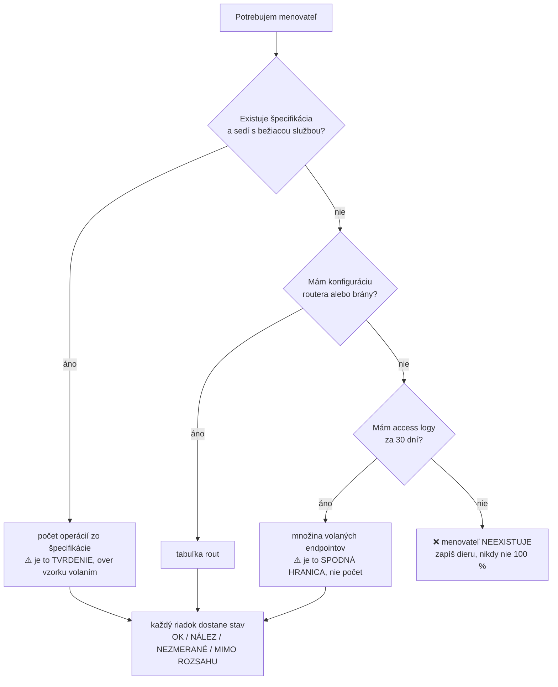

# QA matice a dokumentácia

> **Matica, ktorá nevie odlíšiť „skontrolované a čisté" od „nikdy som sa nepozrel",
> nie je matica. Je to obrázok pokrytia.**

Kritický krok pred výstupom: `_lib/KRITIK.md`.
**Otázka pre tento skill:** *Objaví sa v tejto tabuľke riadok, na ktorý som zabudol —
alebo by tam ticho chýbal?*

---

## 1. Štyri stavy, nikdy dva

| stav | význam |
| --- | --- |
| **OK** | skontrolované, správalo sa správne |
| **NÁLEZ** | skontrolované, správalo sa zle |
| **NEZMERANÉ** | **nepozrel som sa** — nie je to to isté ako OK |
| **MIMO ROZSAHU** | vedome vynechané, **s dôvodom** |

❌ Prázdna bunka a `N/A` sú zakázané — obe sa čítajú ako „netreba"
a obe sú miesto, kde sa schová „nestihol som".

## 2. Súčtový invariant

> `OK + NÁLEZ + NEZMERANÉ + MIMO ROZSAHU = celkový počet`

Celkový počet **musí prísť z nezávislého zdroja**, nie z tej istej tabuľky.
Inak sa riadok, na ktorý si zabudol, v tabuľke **vôbec neobjaví**.

## 3. Menovateľ — po tomto rebríku, prvý dostupný vyhráva

> **Čo sa musí sčítať, nesmie byť diagram.** Obrázok sa nedá zoradiť, filtrovať ani diffnúť,
> takže súčtový invariant sa v ňom neoverí. Diagram patrí len otázke „kade sa tam dostanem".

**Zdroj menovateľa napíš do hlavičky tabuľky.** Bez neho sa číslo o týždeň nedá zopakovať.
Rozdiel medzi špecifikáciou a logmi je **nález**: endpoint v špecifikácii, ktorý nikto nevolá,
aj endpoint v logoch, ktorý špecifikácia nepozná.

## 4. Pokrytie je tvrdenie o DETEKCII, nie percento

Vzor, ktorý sa dá vyvrátiť: *„Ak by tu bola vážna chyba, pravdepodobne by sme o nej vedeli."*
Percento také tvrdenie nenesie — nedá sa spochybniť ani sondou overiť.

| stupeň | čo to znamená |
| :---: | --- |
| **0** | **nemám o tejto oblasti dobrú informáciu** *(= NEZMERANÉ)* |
| **1** | sanity — hlavné funkcie, jednoduché dáta |
| **2** | všetky funkcie dotknuté, bežné a kritické prípady vykonané |
| **2+** | niečo navyše k dátam, stavom alebo chybovým cestám |
| **3** | hraničné prípady — dáta, stavy, chyby, záťaž |

**Kto napíše 3, musí menovať SONDU** — chybu, ktorú tam zaviedol a test ju chytil.
Bez sondy patrí **2**. ❌ Percento na stupeň neprepočítavaj — stupeň 2 je 50–90 % riadkov.

## 5. Riziko: dva FAKTY namiesto dvoch dohadov

| ❌ nerob | ✅ rob |
| --- | --- |
| pravdepodobnosť × dopad | **zmenené × nevykonané** |
| absolútny počet commitov | **relatívny churn** = commity ÷ riadky ÷ dĺžka okna |
| farebná mriežka | plochý zoznam podľa merateľných kritérií |

🔴 **Farebnú maticu rizík nefarbi vôbec.** Namerané *(Cox 2008)*: typická matica
jednoznačne a správne porovná **menej než 10 %** náhodných dvojíc hrozieb, a keď sú
frekvencia a závažnosť negatívne korelované — v softvéri bežný stav — **dáva horšie
poradie než náhoda**.

Ak ju vyžaduje audit, sprav ju, ale do hlavičky napíš doslova:
*„Poradie v tejto tabuľke nie je merané. Je to dohodnuté zoradenie zo dňa X, dohodli Y."*

### Ako sa tie dve osi merajú

| os | ako | pozor |
| --- | --- | --- |
| **zmenené** | `git diff <ref>...HEAD` → dotknuté endpointy | referenčný bod **do hlavičky** |
| **nevykonané** | čoho sa dotkol **reálny beh** suity | bez pokrytia čítaj **access logy počas behu** — `method + route` stačí |

| **zmenené ∧ nevykonané** → sem daj čas · zmenené ∧ vykonané → ⚠️ **nie je zelená**, vykonanie nie je asercia · ostatné dve → vypíš s počtami |
| --- |

Jednotka je **endpoint**, nikdy riadok kódu. **Nízky churn nie je OK, je NEZMERANÉ.**

## 6. Report — tri pramene, vždy v tomto poradí

| # | prameň | artefakt |
| :---: | --- | --- |
| 1 | **PRODUKT** — čo funguje, čo zlyháva, čo môže zlyhať tak, že to vadí | id nálezov |
| 2 | **AKO SOM TESTOVAL** — konfigurácia, orákulá, kde som sa **nepozeral** | príkaz, ktorý si spustia sami + zoznam NEZMERANÉ |
| 3 | **ČO BRÁNILO TESTOVANIU** | zoznam prekážok |

**Prameň 3 je povinný a patrí HORE**, nie do prílohy. Je jediný, ktorý hovorí o dierach,
a prvý, ktorý pri zhone vypadne. Keď prekážky nie sú, napíš *„bez prekážok"* — nie nič.

**Zhrňujúci list nad maticou:** 15–30 riadkov,
`OBLASŤ · ÚSILIE · POKRYTIE · NÁLEZY · POZNÁMKA`

| stĺpec | pravidlo |
| --- | --- |
| **riadky** | **generuj z inventára** — zhrnutie, čo sa nedá rozbaliť späť, zmaž |
| **ÚSILIE** | skutočný čas, nie hviezdičky. **Nula je platná hodnota**: „pokrytie 0 po troch dňoch" a „pokrytie 0, nepozrel som sa" sú dve rôzne správy |
| **hlavička** | **DÁTUM a BUILD**. Bunka z staršieho buildu = **NEZMERANÉ**, nie OK — stará zelená je tvrdenie o inom kóde |

## 7. Dva zoznamy: NÁLEZY a PREKÁŽKY

| | ohrozuje | príklad |
| --- | --- | --- |
| **NÁLEZ** | hodnotu **produktu** | 5xx, obídená autorizácia, stratený zápis |
| **PREKÁŽKA** | hodnotu **môjho testovania** | chýbajúci prístup, mŕtve prostredie, neexistujúci orákul |

Prekážka nie je chyba *(tiket sa nezaloží)* ani hotová práca *(v postupe sa neukáže)* —
**bez vlastného zoznamu z reportu ticho zmizne.**

Každý riadok má tri povinné polia: **dátum** · **koľko riadkov NEZMERANÉ drží** *(číslo)* ·
**meno človeka, ktorý ju vie odblokovať.** Bez adresáta je to sťažnosť.

## 8. Traceability a generovanie

| pravidlo | prečo |
| --- | --- |
| **oba smery**, obidva zhodia bránu | jeden smer chytí pridanie, **nie premenovanie** |
| **niet registra požiadaviek → RTM NEROB** | vyrobil by si menovateľ, ktorý si si vymyslel. Rob **inventár** podľa §3 |
| **zelená v nástroji býva odkaz, nie beh** | pýtaj sa: *prepojenie, alebo posledný beh s verdiktom?* `skipped` a `not-run` musia byť odlíšené od `pass` |
| **matica sa generuje, nie udržiava** | ručná je snímka, generovaná je monitor; brána padne v **oboch** smeroch |

---

## Anti-vzory

| anti-vzor | prečo zlyhá |
| --- | --- |
| prázdna bunka alebo `N/A` | schová „nepozrel som sa" |
| percento bez menovateľa | tvrdenie o rozsahu bez rozsahu |
| farebná mriežka rizík | horšie poradie než náhoda *(Cox 2008)* |
| absolútny churn | vytiahne veľké staré súbory |
| tabuľka, ktorá len rastie | zhoršenie sa schová dopĺňaním riadkov |
| traceability v jednom smere | nechytí premenovanie |
| diagram namiesto tabuľky | **čo sa musí sčítať, nesmie byť diagram** |
| pyramída testov v dokumente | obrázok názoru, nie dát projektu |
| meniaci sa tvar reportu | umožňuje výberové čítanie |

## Súvisiace

`readme-test-repo-pattern` *(rozloženie README testovacieho repozitára — táto disciplína
aplikovaná na jeden artefakt)* · `test-strategy` *(mapovanie akceptačných kritérií na testy)* ·
`gate-audit` *(brány, ktoré mlčia)* · `_lib/KRITIK.md`

---

## Kritik — povinné pred výstupom

Postup: `_lib/KRITIK.md`

> **Otázka pre tento skill:** Prišiel menovateľ z NEZÁVISLÉHO inventára a padne tabuľka aj na riadok, ktorý v nej CHÝBA?
